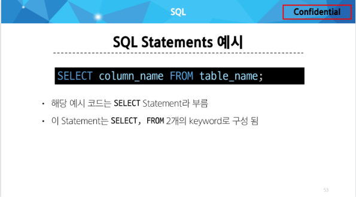
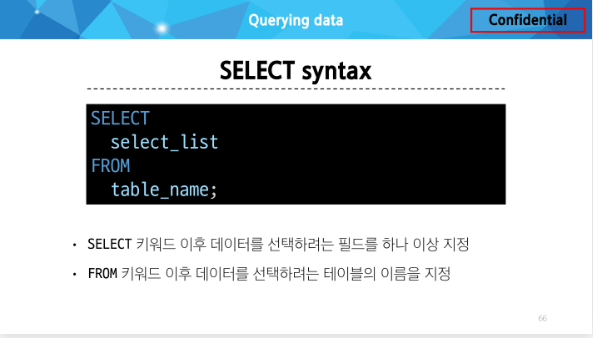

# Database
- 체계적인 데이터 모음
# 데이터
- 저장이나 처리에 효율적인 형태로 변환된 정보

---
- 기존의 데이터 저장 방식
  - 파일 이용
    - 어디에서나 쉽게 사용 가능
    - 데이터를 구조적으로 관리하기 어려움
  - 스프레드 시트 이용
    - 테이블의 열과 행을 사용해 데이터를 구조적으로 관리 가능
  
---
- 스프레드 시트의 한계
  - 크기 
    - 일반적으로 약 100만 행까지만 저장 가능
  - 보안
    - 단순히 파일이나 링크 소유 여부에 따른 단순한 접근 권한 기능 제공
  - 정확성
    - 만약 공식적으로 '강원'의 지명이 '강언'으로 바뀌었다고 가정한다면 ?
    - 이 변경으로 인해 테이블 모든 위치에서 해당 값을 업데이트 해야 함
    - 찾기 및 바꾸기 기능을 사용해 바꿀수 있지만 만약 데이터가 여러 시트에 분산되어 있다면 변경에 누락이 생기거나 추가 문제가 발생 할 수 있음


# 관계형 데이터베이스
- 데이터 간에 관계가 있는 데이터 항목들의 모음
  - 테이블, 행, 열의 정보를 구조화하는 방식
  - 서로 관련된 데이터 포인터를 저장하고 이에 대한 액세스를 제공
  
- 관계
  - 여러 테이블 간의 (논리적) 연결


### 관계형 데이터베이스 관련 키워드
- Table
  - 데이터를 기록하는 곳
- Field
  - 각 필드에는 고유한 데이터 형식(타입)이 지정됨
- Record
  - 각 레코드에는 구체적인 데이터 값이 저장됨
- Database
  - 테이블의 집합
- Primary Key(기본 키, PK)
  - 각 레코드의 고유한 값
  - 관계형 데이터베이스에서 **레코드의 식별자**로 활용
- Foreign Key(외래 키, FK)
  - 테이블의 필드 중 다른 테이블의 레코드를 식별할 수 있는 키
  - 다른 테이블의 기본 키를 참조
  - 각 레코드에서 서로 다른 테이블 간의 관계를 만드는 데 사용

---

# RDBMS

### DBMS
- 데이터베이스를 관리하는 소프트웨어 프로그램

### RDBMS
- 관계형 데이터베이스를 관리하는 소프트웨어 프로그램
  - 종류
    - SQLite
    - MySQL
    - PostgreSQL
    - Oracle Database
    - .....


---

# SQL

- 데이터베이스에 정보를 저장하고 처리하기 위한 프로그래밍 언어
  
### SQL Syntax
- SQL 키워드는 대소문자를 구분하지 않음
  - 하지만 대문자로 작성하는 것을 권장(명시적 구분)

- 각 SQL Statements의 끝에는 세미콜론(';')이 필요
  - 세미콜론은 각 SQL Statements을 구분하는 방법(명령어의 마침표)

### SQL Statements 



### 수행 목적에 따른 SQL Statements 4가지 유형
- DDL : 데이터 정의
  - 역할 : 데이터 기본 구조 및 형식 변경
    - SQL 키워드
      - CREATE(테이블 생성)
      - DROP(테이블과 관련된거 삭제)
      - ALTER(테이블과 관련된거 수정)
- DQL : 데이터 검색
  - 역할 : 데이터 검색
    - SQL 키워드
      - SELECT
- DML : 데이터 조작
  - 역할 : 데이터 조작
    - SQL 키워드
      - INSERT
      - UPDATE
      - DELETE
- DCL : 데이터 제어
  - 역할 : 데이터 및 작업에 대한 사용자 권한 제어
    - SQL 키워드
      - COMMIT
      - ROLLBACK
      - GRANT
      - REVOKE
---


### SELECT
- SELECT statement
  - 테이블에서 데이터를 조회
  - 

---

# Single Table Queries

- SELECT statement 실행 순서
- 테이블에서 (FROM)
- 특정 조건에 맞추어 (WHERE)
- 그룹화 하고 (GROUP BY)
- 만약 그룹화 조건이 있다면 맞추고 (HAVING)
- 조회하여 (SELECT)
- 정렬하고 (ORDER BY)
- 특정 위치의 값을 가져옴 (LIMIT)

```


-- 01. Querying data
-- SELECT 필드명 FROM 테이블명
SELECT
  LastName
FROM 
  employees;

-- 테이블 employees에서 LastName, FirstName 필드의 모든 데이터를 조회
SELECT 
  LastName, FirstName
FROM
  employees;

-- 테이블 employees에서 모든 필드 데이터를 조회
SELECT 
  *
FROM
  employees;

-- 조회 시 'FirstName'이 아닌 '이름'으로 출력
SELECT 
  FirstName AS '이름'
FROM
  employees;

-- 테이블 track에서 Name, Milliseconds 필드의 모든 데이터 조회
-- (단, Milliseconds 필드는 60000으로 나눠 분 단위 값으로 출력)
SELECT 
  Name,
  Milliseconds / 60000 AS '재생시간(분)'
FROM
  tracks;


-- 02. Sorting data
-- 테이블 employees에서 FirstName 필드의 모든 데이터를 오름차순으로 조회
SELECT
  FirstName
FROM 
  employees
ORDER BY
  FirstName;

-- 테이블 employees에서 FirstName 필드의 모든 데이터를 내림차순으로 조회
SELECT
  FirstName
FROM 
  employees
ORDER BY
  FirstName DESC;

-- 테이블 customers에서 Country 필드의 기준으로 내림차순 정렬한 다음 
-- City 필드 기준으로 오름차순 정렬하여 조회
SELECT
  Country, City
FROM 
  customers
ORDER BY
  Country DESC,
  City ASC;

-- 테이블 tracks에서 Milliseconds 필드를 기준으로 내림차순 정렬한 다음 
-- Name, Milliseconds 필드의 모든 데이터를 조회
-- 단, Miliseconds 필드는 60,000으로 나눠 단위 값으로 출력
SELECT
  Name,
  Milliseconds / 60000 AS '재생 시간(분)'
FROM 
  tracks
ORDER BY
  Milliseconds DESC;

-- NULL 정렬 예시
-- NULL 값이 존재할 경우 오름차순 정렬 시 결과에 NULL이 먼저 출력

SELECT
  ReportsTo
FROM 
  employees
ORDER BY
  ReportsTo;

-- SELECT statement 실행 순서
-- FROM -> SELECT -> ORDER BY
-- 1. 테이블에서 (FROM) 2. 조회하여 (SELECT) 3. 정렬(ORDER BY)

-- 03. Filtering data


-- DISTINCT statement
-- 조회 결과에서 중복된 레코드를 제거

-- 테이블 customers에서 Country 필드의 모든 데이터를 오름차순 조회
SELECT
  Country
FROM
  customers
ORDER BY
  Country;

-- 테이블 customers에서 Country 필드의 모든 데이터를 중복없이 오름차순 조회
SELECT DISTINCT
  Country
FROM 
  customers
ORDER BY
  Country;

-- WHERE statement
-- 조회 시 특정 검색 조건을 지정

-- 테이블 customers에서 City 필드 값이, 'Prague'인 데이터의
-- LastName, FirstName, City 조회
SELECT
  LastName, FirstName, City
FROM
  customers
WHERE
  City = 'Prague';

-- 테이블 customers에서 City 필드 값이, 'Prague'가 아닌 데이터의
-- LastName, FirstName, City 조회
SELECT
  LastName, FirstName, City
FROM
  customers
WHERE
  City != 'Prague';

-- 테이블 customers에서 Company 필드 값이 NULL이고, 
-- Country 필드 값이 'USA'인 데이터의
-- LastName, FirstName, Company, Country 조회
SELECT
  LastName, FirstName, Company, Country
FROM
  customers
WHERE
  Company IS NULL
  AND Country = 'USA';

-- 테이블 customers에서 Company 필드 값이 NULL이거나, 
-- Country 필드 값이 'USA'인 데이터의
-- LastName, FirstName, Company, Country 
SELECT
  LastName, FirstName, Company, Country
FROM
  customers
WHERE
  Company IS NULL
  OR Country = 'USA';

-- 테이블 tracks에서 Bytes 필드 값이, 10,000 이상 500,000 이하인
-- 데이터의 Name, Bytes 조회
SELECT
  Name, Bytes
FROM
  tracks
WHERE
  Bytes BETWEEN 100000 AND 500000;

-- 테이블 tracks에서 Bytes 필드 값이, 10,000 이상 500,000 이하인
-- 데이터의 Name, Bytes를 Bytes 기준으로 오름차순 조회
SELECT
  Name, Bytes
FROM
  tracks
WHERE
  Bytes BETWEEN 100000 AND 500000
ORDER BY
  Bytes;

-- 테이블 customers에서 Country 필드 값이, 
-- 'Canada' 또는 'Germany' 또는 'France'인 데이터의
--  LastName, FirstName, Country 조회
SELECT
  LastName, FirstName, Country
FROM
  customers
WHERE
  Country IN ('Canada','Germany','France');

-- 테이블 customers에서 Country 필드 값이, 
-- 'Canada' 또는 'Germany' 또는 'France'가 아닌 데이터의
--  LastName, FirstName, Country 조회
SELECT
  LastName, FirstName, Country
FROM
  customers
WHERE
  Country NOT IN ('Canada','Germany','France');

-- 테이블 customers에서 LastName 필드 값이, 
-- 'son'으로 끝나는 데이터의 LastName, FirstName 조회
SELECT
  LastName, FirstName
FROM
  customers
WHERE
  LastName LIKE '%son';

-- 테이블 customers에서 FirstName 필드 값이 4자리면서, 
-- 'a'으로 끝나는 데이터의 LastName, FirstName 조회
SELECT
  LastName, FirstName
FROM
  customers
WHERE
  FirstName LIKE '___a';

-- Wildcard Characters

-- '%' : 0개 이상의 문자열과 일치 하는지 확인
-- '_' : 단일 문자와 일치하는지 확인


-- LIMIT 활용 1
-- 테이블 track에서 Trackid, Name, Bytes 필드 데이터를
-- Bytes 기준 내림차순으로 7개만 조회

SELECT
  TrackId, Name, Bytes
FROM
  tracks
ORDER BY Bytes DESC
LIMIT 7;


-- LIMIT 활용 2
-- 테이블 track에서 Trackid, Name, Bytes 필드 데이터를
-- Bytes 기준 내림차순으로 4번째부터 7개만 조회

SELECT
  TrackId, Name, Bytes
FROM
  tracks
ORDER BY 
  Bytes DESC
LIMIT 3, 4;
-- LIMIT 4 OFFSET 3;


-- 04. Grouping data


-- GROUP BY syntax
-- FROM 및 WHERE 절 뒤에 배치
-- GROUP BY 절 뒤에 그룹화 할 필드 목록을 작성

-- Country 필드를 그룹화
SELECT
  Country
FROM
  customers
GROUP BY
  Country;


-- COUNT 함수가 각 그룹에 대한 집계된 값을 계산
SELECT
  Country, COUNT(*)
FROM
  customers
GROUP BY
  Country;

-- 테이블 tracks에서 Composer 필드를 그룹화하여 각 그룹에 대한
-- Bytes의 평균 값을 내림차순 조회

SELECT
  Composer,
  AVG(Bytes)
FROM
  tracks
GROUP BY
  Composer
ORDER BY
  AVG(Bytes) DESC;


SELECT
  Composer,
  AVG(Bytes) AS avgOfBytes
FROM
  tracks
GROUP BY
  Composer
ORDER BY
  avgOfBytes DESC;


-- 테이블 tracks에서 Composer 필드를 그룹화하여 각 그룹에 대한
-- Milliseconds의 평균 값이 10 미만인 데이터 조회
-- (단, Milliseconds필드는 60,000으로 나눠 분 단위 값의 평균으로 계산)

-- 에러 발생

SELECT
  Composer,
  AVG(Milliseconds / 60000) AS avgOfMinute
FROM
  tracks
WHERE
  avgOfMinute < 10
GROUP BY
  Composer;

-- 에러 발생


SELECT
  Composer,
  AVG(Milliseconds / 60000) AS avgOfMinute
FROM
  tracks
GROUP BY
  Composer
HAVING
  avgOfMinute < 10;

```

---

# Managing Tables

- NULL : 아무런 값도 포함하지 않음을 나타냄
- INTEGER : 정수
- REAL : 부동 소수점
- TEXT : 문자열
- BLOB : 이미지, 동영상, 문서 등의 바이너리 데이터


### Constraints 제약 조건
- 테이블의 필드에 적용되는 규칙 또는 제한 사항
  - 데이터의 무결성을 유지하고 데이터베이스의 일관성을 보장

### 대표 제약 조건 3가지
- PRIMARY KEY
  - 해당 필드를 기본 키로 지정
    - INTEGER 타입에만 적용되며 INT, BIGINT 등과 같은 다른 정수 유형은 적용되지 않음
- NOT NULL
  - 해당 필드에 NULL 값을 허용하지 않도록 지정
- FOREIGN KEY
  - 다른 테이블과의 외래 키 관계를 정의


### AUTOINCREMENT keyword
- 자동으로 고유한 정수 값을 생성하고 할당하는 필드 속성
  - 특징
    - 필드의 자동 증가를 나타내는 특수한 키워드
    - 주로 primary key 필드에 적용
    - INTEGER PRIMARY KEY AUTOINCREMENT가 작성된 필드는
    - 항상 새로운 레코드에 대해 이전 최대 값보다 큰 값을 할당
    - 삭제된 값을 무시되며 재사용할 수 없게 됨


### ALTER TABLE statement
- ALTER TABLE ADD COLUMN : 필드 추가
- ALTER TABLE RENAME COLUMN : 필드 이름 변경
- ALTER TABLE RENAME TO : 테이블 이름 변경
- DROP TABLE statement : 테이블 삭제


```
-- Table 구조 확인
PRAGMA table_info('examples');


-- 1. Create a table
CREATE TABLE examples (
  ExamId INTEGER PRIMARY KEY AUTOINCREMENT,
  LastName VARCHAR(50) NOT NULL,
  FirstName VARCHAR(50) NOT NULL
);


-- 2. Modifying table fields

-- 2.1 ADD COLUMN

-- examples 테이블에 다음 조건에 맞는 Country 필드 추가
-- 테이블 생성시 정의한 필드는 기본값이 없어도 NOT NULL 제약조건으로 생성되며,
-- 내부적으로 Default value는 NULL로 설정됨

ALTER TABLE
  examples
ADD COLUMN
  Country VARCHAR(100) NOT NULL DEFAULT 'default value';

-- sqlite는 단일 문을 사용하여 한번에 여러 열을 추가하는 것을 지원하지 않음

-- examples 테이블에 다음 조건에 맞는 Age, Address 필드 추가

ALTER TABLE 
  examples
ADD COLUMN
  Age INTEGER NOT NULL DEFAULT 0;

ALTER TABLE 
  examples
ADD COLUMN
  Address VARCHAR(100) NOT NULL DEFAULT 'default value';


-- 2.2 RENAME COLUMN
ALTER TABLE
  examples
RENAME COLUMN
  Address TO PostCode;

-- DROP COLUMN (특정 컬럼 삭제)
-- VS Code.에서 , 우클릭, Run Query가 가능한 이유는 ?
-- extensions을 설치 했기 때문인데,,,, 그 sqlite 확장툴이 최신 버전 지원 안하기 때문임

-- ALTER TABLE
--   examples
-- DROP COLUMN
--   PostCode;


-- 2.3 RENAME TO

ALTER TABLE
  examples
RENAME TO
  new_examples;


PRAGMA table_info('new_examples');

-- 3. Delete a table
DROP TABLE new_examples;

-- sqlite는 컬럼 수정 불가
-- 대신 테이블의 이름을 바꾸고, 새 테이블을 만들고 데이터를 새 테이블에 복사하는 방식을 사용

```


# Modifying Data

### Insert data
- INSERT statement
  - 테이블 레코드 삽입