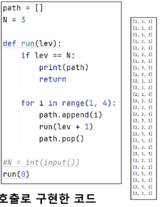
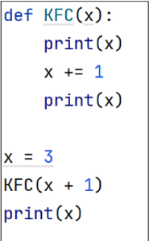
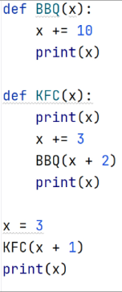

### 20240227 완전검색

#### 재귀

- 반복 : 수행하는 작업이 완료될 때 까지 게속 반복
  - 반복문은 코드를 n번 반복시킬 수 있다.
    
- 반복 문으로는 n 번 반복을 구현할 수 있고,
  재귀호출로 n중 for문을 구현할 수 있다.
  
- 재귀는 주어진 문제의 해를 구하기 위해 동일하면서 더 작은 문자를 이용하는방법
   - 재귀호출은 n중 반복문을 만들어낼수있다. 
    - 재귀 함수 : 자기 자신을 반복하는 함수
    

- 재귀를 연습하기 전, 알야아 할 함수의 특징 
    - **값**만 복사가 된다
      
    - 해당 함수를 호출했던 곳으로 돌아온다
    

- 재귀호출 코드가 2개, 간략화 하여 그리기

  
- 재귀호출 코드가 3개
- KFC 함수 내부에 KFC(x+1) 재귀 호출 코드가 세 개

  

##### 순열

- 서로 다른 N개에서, R개를 중복없이, 순서를 고려하여 나열하는 것.

##### 중복순열

- 서로 다른 N개에서, R개를 중복을 허용하고, 순서를 고려하여 나열하는 것.
- 구현 원리 : 재귀호출을 할 때 마다, 이동 경로를 흔적으로 남긴다.

- 기저조건일때 (print)출력을해준다

- 이미 사용한 숫자인지 아닌지 구분하는 List 준비하기

