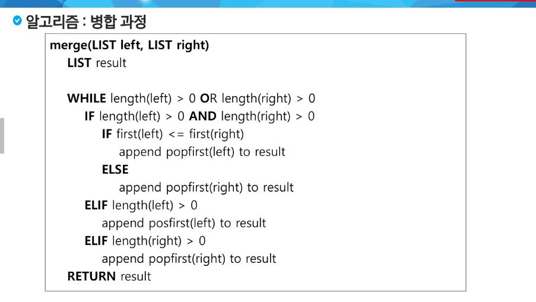

### 분할 정복 기법 예시

'''
분할 정복 기법을 거듭 제곱 문제를 통해 이해해보자.
자연수 C의 n 제곱 값을 구하는 함수를 구현해보자
'''

### 병합정렬

#### 분할과정

#### 병합과정

### 퀵 정렬
- 다른 점 1 : 병합 정렬은 그냥 두 부분으로 나누는 반면에, 퀵 정렬은 분할할 때, 기준아이템 중심으로 분할한다.
- 기분보다 작은 것은 왼편, 큰것은 오른편에 위치시킨다.

- 다른 점 2 : 각 부분 정렬이 끝난 후, 병합정렬은 '병합'이란 후 처리 작업이 필요하나, 퀵 정렬은 필요로 하지 않는다.