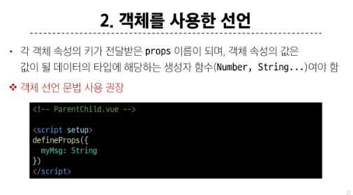
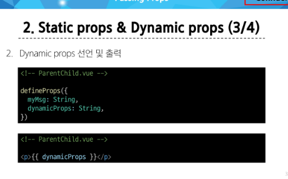

# Props
- 부모 컴포넌트로부터 자식 컴포넌트로 데이터를 전달하는데 사용되는 속성

### 특징
- 부모 속성이 업데이트되면 자식으로 전달 되지만 그 반대는 안됨
- 즉, 자식 컴포넌트 내부에서 props를 변경하려고 시도해서는 안되며 불가능
- 또한 부모 컴포넌트가 업데이트될 때마다 이를 사용하는 자식 컴포넌트의 모든 props가 최신 값으로 업데이트 됨
- 부모 컴포넌트에서만 변경하고 이를 내려 받는 자식 컴포넌트는 자연스럽게 갱신

### props 선언
- 문자열 배열을 사용한 선언
- 

- 객체를 사용한 선언
- 

### Static props & Dynamic props
- Dynamic props 정의
- 

- Dynamic props 선언 및 출력
- 

- $emit()
- 자식 컴포넌트가 이벤트를 발생시켜 부모 컴포넌트로 데이터를 전달하는 역할의 메서드
- 메서드 구조
- emit(event, ...args)
- event : 커스텀 이벤트 이름
- args : 추가 인자