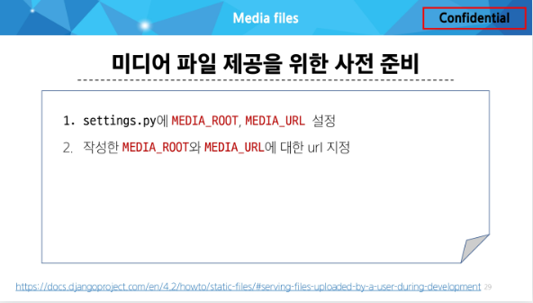
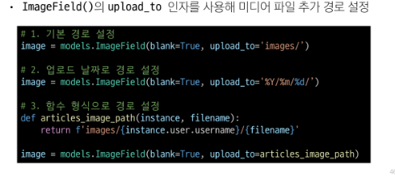

### 20240328 static files

- 사용자에게 어떤 정적인 파일을 제공하는 단계
  
#### 웹 서버와 정적 파일

- 결국 정적파일도 제공하기 위한 경로(URL) 가 있어야 함

#### Static files 제공하기
- 기본 경로에서 제공하기
- 추가 경로에서 제공하기

#### STATIC_URL

- 경로 잘 설정하면 알아서 setting.py에 만들어진다.

#### Media Files
- 사용자가 웹에서 업로드하는 정적 파일

#### ImageFiedls()
- 이미지 업로드에 사용하는 모델 필드

### upload_to 
