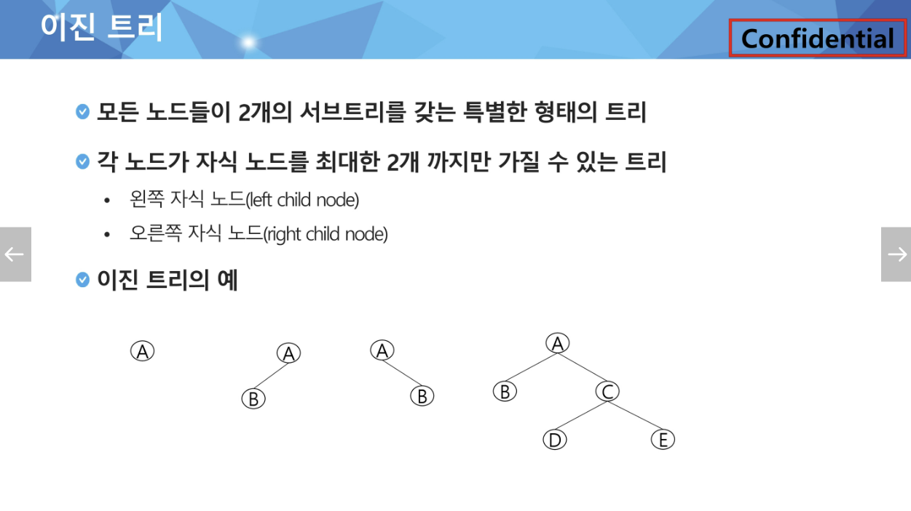
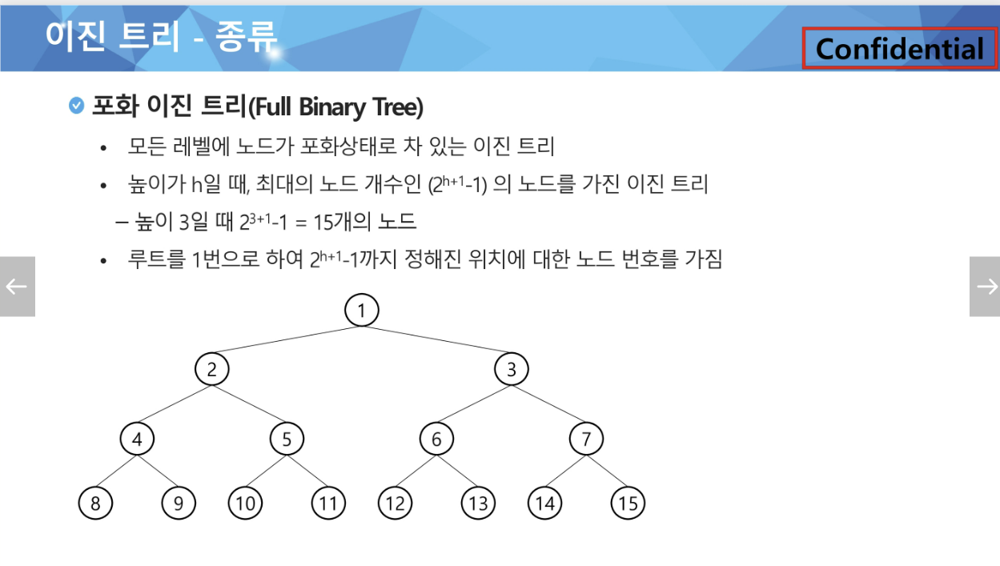

### 과목평가 / 월팡평가 대비 서술형

#### 반복문자 지우기

#### 이진트리란 ? 중위 순회란 ? 
- 이진트리 : 모든 노드들이 서브트리를 2개 까지만 가질 수 있는 트리
- 모든 트리들이 자식노드를 최대한 2개 까지만 가질 수 있는 트리
- 서브트리 : 부모노드와 연결된 간선을 끊었을 떄 생성되는 트리

#### 포화트리 / 완전트리

- 포화트리

  
- 완전트리
![img_2.png](img_2.png
  
  
https://velog.io/@dlgosla/CS-%EC%9E%90%EB%A3%8C%EA%B5%AC%EC%A1%B0-%EC%9D%B4%EC%A7%84-%ED%8A%B8%EB%A6%AC-Binary-Tree-vzdhb2sp
