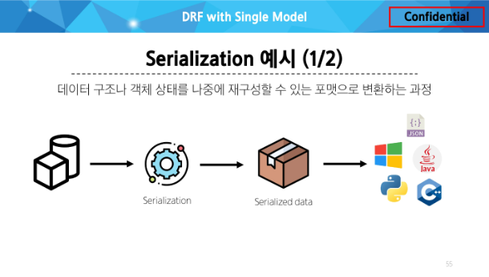

# API
- 두 소프트웨어가 서로 통신할 수 있게 하는 메커니즘
  - 클라이언트 : 서버처럼 서로 다른 프로그램에서 요청과 응답을 받을 수 있도록 만든 체계

---

### Web API
- 웹 서버 또는 웹 브라우저를 위한 API
- 현대 웹 개발은 하나부터 열까지 직접 개발하기보다 여러 Open API 들을 활용하는 추세
- 대표적인 Third Party Open API 서비스 목록
  - Youtube API
  - Google Map API
  - Naver Papago API
  - Kakao Map API

---

### REST
- API server를 개발하기 위한 일종의 소프트웨어 설계 "방법론"

- REST에서 자원을 사용하는 법 3가지
  1. 자원의 식별
     - URI
  2. 자원의 행위
     - HTTP Methods
  3. 자원의 표현  
     - JSON 데이터
     - 궁극적으로 표현되는 데이터 결과물


---

### URI
- 인터넷에서 리소스(자원)를 식별하는 문자열
- 가장 일반적인 URI는 웹 주소로 알려진 URL

### URL
- 웹에서 주어진 리소스의 주소
- 네트워크 상에 리소스가 어디 있는지를 알려주기 위한 약속

### Domain Name
- 원래의 서버 주소는 IP 주소 142.251.42.142 이런식인데
- 도메인 이름을 써서 google.com이라는 주소로 표현할수 있다.

### Anchor
- 일종의 '북마크'를 나타내면 브라우저에 해당 지점에 있는 콘텐츠를 표시
- '#' 이후 부분은 서버에 전송되지 않음
- 
- 요청에서 #quick-install-guide는 서버에 전달되지 않고 브라우저에게 해당 지점으로 이동할 수 있도록 함


---

### HTTP Request Methods 
- 리소스에 대한 행위(수행하고자 하는 동작)를 정의
  - HTTP verbs 라고도 함

#### GET
- 서버에 리소스의 표현을 요청
- GET을 사용하는 요청은 데이터만 검색하야 함
#### POST
- 데이터를 지정된 리소스에 제출
- 서버의 상태를 변경
#### PUT
- 요청한 주소의 리소스를 수정
#### DELETE
- 지정된 리소스를 삭제


---

### HTTP response status codes
- 5개의 응답 그룹
  - Informational responses (100-199)
  - Succesfful responses (200-299)
  - Redirection messages (300-399)
  - Client error responses (400-499)
  - Server error responses (500-599)
  - 2,4,5번째를 중심으로 알면 된다 !


---
# GET
- Serializtion
- 직렬화
- 여러 시스템에서 활용하기 위해 데이터 구조나 객체 상태를 나중에 재구성할 수 있는 포맷으로 변환하는 과정
- 데이터 구조나 객체 상태를 나중에 재구성할 수 있는 포맷으로 변환하는 과정
- 


```py
# apps/serializers.py
from rest_framework import serializers
from .models import Article

class ArticleListSerializer(serializers.ModelSerializer):
    
    class Meta:
        model = Article
        fields = ('id', 'title', 'content',)

```


### ModelSerializer
- Django 모델과 연결된 Serizlizer 클래스
- 일반 Serializer와 달리 사용자 입력 데이터를 받아 자동으로 모델 필드에 맞추어 Serialization을 진행
- url 및 view함수 작성


```py
# aritlces/urls.py
from django.urls import path
from . import views


urlpatterns = [
    path('articles/', views.article_list),
]

```


```py
# aritlces/views.py

from rest_framework.response import Response
from rest_framework.decorators import api_view

from .models import Article
from .serializers import ArticleListSerializer

@api_view(['GET'])
def article_list(request):
    articles = Article.objects.all()
    serializer = ArticleListSerializer(articles, many=True)
    # 여기서는 articles가 QuerySet이기 때문에 입력해줘야 된다.
    # Serialize 대상이 QuerySet인 경우 입력
    # 다중 데이터이기 때문에 many를 꼭 True로 해줘야 된다.
    return Response(serializer.data)
    # Serialized data 객체에서 실제 데이터를 추출
```

---

# POST
- 게시글 데이터 생성하기
  - 데이터 생성이 성공했을 경우 201 Creatd응답
  - 데이터 생성이 실패 했을 경우 400 Bad request 응답

```py

# apps/views.py
from rest_framework import status


@api_view(['GET', 'POST'])
def article_list(request):
    if request.method == 'GET':
        articles = Article.objects.all()
        serializer = ArticleListSerializer(articles, many=True)
        # 여기서는 articles가 QuerySet이기 때문에 입력해줘야 된다.
        # Serialize 대상이 QuerySet인 경우 입력
        # 다중 데이터이기 때문에 many를 꼭 True로 해줘야 된다.
        return Response(serializer.data)
        # Serialized data 객체에서 실제 데이터를 추출
    
    elif request.method == 'POST':
        serializer = ArticleSerializer(data=request.data)
        if serializer.is_valid():
            serializer.save()
            return Response(serializer.data, status=status.HTTP_201_CREATED)
        return Response(serializer.errors, status = status.HTTP_400_BAD_REQUEST)

```


# DELETE
- 게시글 데이터 삭제하기
  - 요청에 대한 데이터 삭제가 성공했을 경우 204 No content 응답


```py

@api_view(['GET', 'DELETE'])
def article_detail(request, article_pk):
    article = Article.objects.get(pk = article_pk)
    if request.method == 'GET':
        # 단일데이터
        serializer = ArticleSerializer(article)
        return Response(serializer.data)
    
    elif request.method == 'DELETE':
        article.delete()
        return Response(status=status.HTTP_204_NO_CONTENT)


```


# PUT
- 게시글 데이터 수정하기
  - 요청에 대한 데이터 수정이 성공했을 경우는 200 OK 응답
  

```py

@api_view(['GET', 'DELETE', 'PUT'])
def article_detail(request, article_pk):
    article = Article.objects.get(pk = article_pk)
    if request.method == 'GET':
        # 단일데이터
        serializer = ArticleSerializer(article)
        return Response(serializer.data)
    
    elif request.method == 'DELETE':
        article.delete()
        return Response(status=status.HTTP_204_NO_CONTENT)

    elif request.method == 'PUT':
        serializer = ArticleSerializer(article, data=request.data, partial = True)

        if serializer.is_valid():
            serializer.save()
            return Response(serializer.data, status=status.HTTP_200_OK)
        return Response(serializer.errors, status=status.HTTP_400_BAD_REQUEST)

```