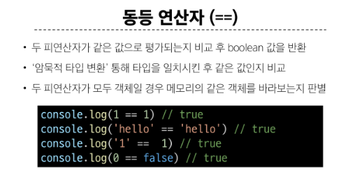

# Basic Syntax 

### let
  - 재할당 가능
  - 재선언 불가능
### const
  - 재할당 불가능
  - 재선언 불가능
### var
  - ES6이전의 쓰던것이기 때문에 지금은 쓰이지 않음

---


### 원시 자료형
- 변수에 값이 직접 저장되는 자료형
  - (불변, 값이 복사)
- 객체의 주소가 저장되는 자료형
  - (가변, 주소가 복사)

### String 예시
- '+' 연산자를 사용해 문자열끼리 결합
- 뺄셈, 곱셈, 나눗셈 불가능


### Template literals(템플릿 리터럴)

- Backtick(``)을 이용하며, 여러 줄에 걸쳐 문자열을 정의할 수도 있고
  - JavaScript의 변수를 문자열 안에 바로 연결할 수 있음
- 표현식은 '$'와 중괄호 (${expression})로 표기


---

# null과 undefined

### null
- 변수의 값이 없음을 의도적으로 표현할 때 사용

### undefined
- 변수 선언 이후 직접 값을 할당하지 않으면 자동으로 할당됨


---

# Boolean

- 조건문 또는 반복문에서 Boolean이 아닌 데이터 타입은 "자동 형변환 규칙"에 따라 
- true 또는 false로 변환됨


---

# 연산자

- 증가 연산자('++')
  - +=
- 감소 연산자('--')
  - -=


### 동등 연산자(==)



### 일치 연산자(===)


### 논리 연산자


---

# 반복문

### while
- 조건문이 참이면 문장을 계속해서 수행

```js
let i = 0

while (i < 6) {
  console.log(i)
  i += 1
}

```


### for
- 특정한 조건이 거짓으로 판별될 때 까지 반복

```js

for (let i = 0; i < 6; i++ ) {
  console.log(i)
}

```


#### for..in

- 객체의 열거 가능한 속성(property)에 대해 반복


```js

const fruits = { a : 'apple', b : 'banana' }
for (variable in fruits) {
  console.log(variable) # a b
  console.log(fruits[variable]) # apple, banana
}


```


#### for...of

```js
const numbers = [0,1,2,3]

for (const number of numbers) {
  console.log(number)
  # 0,1,2,3
}


```

#### for...in, for...if 
- 재할당이 아니라 , 매 반복마다 다른 속성 이름이 변수에 지정되는 것이므로
- const를 사용해도 에러가 발생하지 않음
- 단 , const 특징에 따라 블록 내부에서 변수를 수정할 수 없음


#### 세미콜론
- 자바스크립트는 문장 세미콜론(';')을 선택적으로 사용 가능
- 세미클론이 없으면 ASI에 의해 자동으로 세미콜론이 삽입됨
  - ASI (Automatic Semicolon Insertion, 자동 세미콜론 삽입 규칙)
- JavaScript를 만든 Brendan Eich 또한 세미콜론 작성을 반대