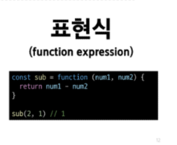
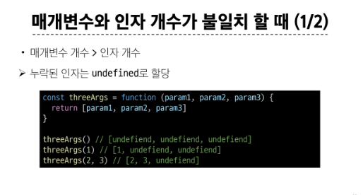
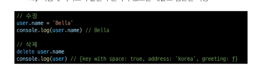
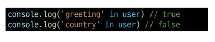
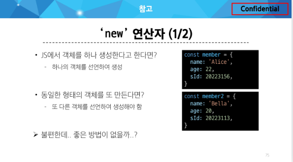
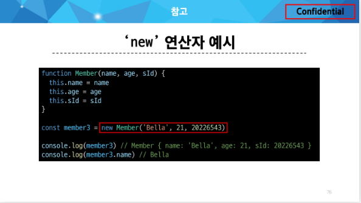

# 함수

### 함수 구조
- function 키워드
- 함수의 이름
- 함수의 매개변수
- 함수의 body를 구성하는 statement
- return 값이 없다면 undefined를 반환한다.

### 함수 정의 2가지 방법
- 선언식
  - 
- 표현식
  - 
  - 사용권장

### 함수 표현식 특징
- 함수 이름이 없는 '익명 함수'를 사용할 수 있음
- 선언식과 달리 표현식으로 정의한 함수는 호이스팅 되지 않으므로 함수를 정의하기 전에 먼저 사용할 수 없음

---
# 매개변수

### 기본 함수 매개변수
- 전달하는 인자가 없거나 undefined가 전달될 경우 이름 붙은 매개변수를 기본값으로 초기화
  
```js
const greeting = function (name = 'Anonymous') {
  return `Hi ${name}`
}

greeting()
// Hi Anonymous

```


### 나머지 매개변수

- 임의의 수의 인자를 '배열'로 허용하여 가변 인자를 나타내는 방법
- 작성 규칙
  - 함수 정의 시 나머지 매개변수는 하나만 작성할 수 있음
  - 나머지 매개변수는 함수 정의에서 매개변수 마지막에 위치해야 함

```js
const myFunc = function(param1, param2, ...restPrams) {
  return [param1, param2, restPrams]
}

myFunc(1,2,3,4,5) # [1,2,[3,4,5]]
myFunc(1,2) # [1,2,[]]

```

### 매개변수와 인자 개수가 불일치 할 때 
- 
- 


---

# '...' (Spread syntax)
- 전개 구문
- 배열이나 문자열과 같이 반복 가능한 항목을 펼치는 것(확정, 전개)
- 전개 대상에 따라 역할이 다름


### 전개 구문 활용처
1. 함수와의 사용
   1. 함수 호출시 인자 확장
   2. 나머지 매개변수 (압축)
2. 객채와의 사용(객체 파트에서 진행)
3. 배열과의 사용(배열 파트에서 진행)


---

# 화살표 함수

```js
const arrow = function (name) {
  return `hello, ${name}`
}

->


const arrow = name => `hello, ${name}`
```

### 화살표 함수 참고
- 
- 권장하지는 않음


-----------------------------


# Object(객체)

```js
const user = {
  name : 'Alice',
  'key with space': true,
  greeting : function() {
    return `hello`
  }
}


```


## 속성 참조

- 점 또는 대괄호로 객체 요소 접근
- key 이름에 띄어쓰기 같은 구분자가 있으면 대괄호 접근만 가능
- 
- 

### 'in' 연산자
- 속성이 객체에 존재하는지 여부를 확인
- 


--- 
# Method

### 'this' keyword
- 함수나 메서드를 호출한 객체를 가리키는 키워드
  - 함수 내에서 객체의 속성 및 메서드에 접근하기 위해 사용


```js
const person = {
  name : 'Alice',
  greeting : functino() {
    return `Hello my name is ${this.name}`
  },
}

console.log(person.greeting())


```


- 자스는 this는 함수를 "호출하는 방법"에 따라 가리키는 대상이 다름

1. 단순 호출 시 this

```js
const myFunc = fucntion () {
  return this
}

console.log(myFunc())

// window

```


2. 메서드 호출 시 this

```js
const myObj = {
  data : 1,
  myFunc : function () {
    return this
  }
}

console.log(myObj.myFunc())
// myObj

```

3. 중첩된 함수에서의 this 문제점과 해결책

```js
// 3. 중첩된 함수
// 3.1 일반 함수 (일반적인 함수 호출이기 때문에 전역 객체)
const myObj2 = {
  numbers: [1, 2, 3],
  myFunc: function () {
    this.numbers.forEach(function (number) {
      console.log(this) // window
    })
  }
}
console.log(myObj2.myFunc())

// 3.2 화살표 함수 (외부 함수의 this를 사용)
const myObj3 = {
  numbers: [1, 2, 3],
  myFunc: function () {
    this.numbers.forEach((number) => {
      console.log(this) // myObj3
    })
  }
}
console.log(myObj3.myFunc())


```


---

# 추가 객체 문법

- 다른건 교재 참고

### Optional chaining 정리
1. obj?.prop
   - obj가 존재하면 obj.prop을 반환하고, 그렇지 않으면 undefined를 반환

2. obj?.[prop]
   - obj가 존재하면 obj[prop]을 반환하고, 그렇지 않으면 undefined를 반환

3. obj?.method()
   - obj가 존재하면 obj.method()를 호출하고, 그렇지 않으면 undefined를 반환


--- 


# JSON

### Object <-> JSON 변환하기







------------------------------


# 배열

- 순서가 있는 데이터 집합을 저장하는 자료구조

```js

const names = ['Alice', 'Bella', 'Cathy']

console.log(names[0]) 
// Alice
console.log(names[1])
// Bella
console.log(names[2])
// Cathy

console.log(names.length)
// 3

```

### 주요 메서드
- push / pop 
  - 배열 끝 요소를 추가 / 제거
- unshift / shift
  - 배열 앞 요소를 추가 / 제거

---
# Array helper method
- 배열 조작을 보다 쉽게 수행할 수 있는 특별한 메서드 모음
- 배열의 각 요소를 순회하며 각 요소에 대해 함수(콜백함수)를 호출
  - forEach(), map(), filter(), every(), some(), reduce()

- forEach() : 배열내의 모든 요소 각각에 대해 함수(콜백함수)를 호출
  - 반환 값 없음
- map() : 배열내의 모든 요소 각각에 대해 함수(콜백함수)를 호출
  - 함수 호출 결과를 모아 새로운 배열을 반환
  - return이 존재한다