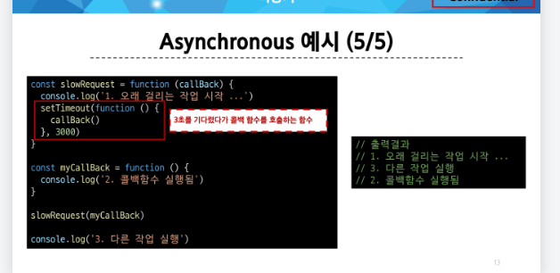
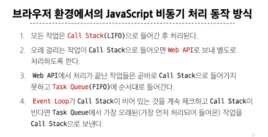

# 비동기

### Synchronous(동기)
- 프로그램의 실행 흐름이 순차적으로 진행
  - 하나의 작업이 완료된 후에 다음 작업이 실행되는 방식

- 예시
  - 

### Asynchronous(비동기)
- 프로그램의 실행 흐름이 순차적이지 않으며, 작업이 완료되기를 기다리지 않고 다음 작업이 실행되는 방식
  - 작업의 완료 여부를 신경 쓰지 않고 **동시에 다른 작업들을 수행할 수 있음**

- 예시
  - 

- 특징
  - 병렬적 수행
  - 당장 처리를 완료할 수 없고 시간이 필요한 작업들은 별도로 요청을 보낸 뒤 응답이 빨리 오는 작업부터 처리

- Single Thread 언어, JavaScript
  - Thread란 ?
    - 작업을 처리할 때 실제로 작업을 수행하는 주체로, multi-thread라면 업무를 수행할 수 있는 주체가 여러 개라는 의미

### 브라우저 환경에서의 JavaScript 비동기 처리 관련 요소
- JavaScript Engine의 Call Stack
- Web API
- Task Queue
- Event Loop

1. Call stack
   - 요청이 들어올 때 마다 순차적으로 처리하는 Stack(LIFO)
   - 기본적인 JavaScript의 Single Thread 작업 처리

2. Web API
   - JavaScript 엔진이 아닌 브라우저에서 제공하는 runtime 환경
   - 시간이 소요되는 작업을 처리

3. Task Queue (Callback Queue)
  - 비동기 처리된 Callback 함수가 대기하는 Queue(FIFO)

4. Event Loop
   - 테스크가 들어오길 기다렸다가 태스크가 들어오면 이를 처리하고, 처리할 태스크가 없는 경우엔 잠드는 , 무한루프임.
   - Call Stack과 Task Queue를 지속적으로 모니터링
   - Call Stack 비어 있는지 확인 후 비어 있다면 Task Queue에서 대기 중인 오래된 작업을 Call Stack으로 Push

---
# Ajax
- XMLHttpRequest 기술을 사용해 복잡하고 동적인 웹 페이지를 구성하는 프로그래밍 방식

# Axios
- JavaScript에서 사용되는 HTTP 클라이언트 라이브러리

### then % catch
- then(callback)
  - 요청한 작업이 성공하면 callback 실행
  - callback은 이전 작업의 성공결과를 인자로 전달 받음

- catch(callback)
  - then()이 하나라도 실패하면 callback 실행 (남은 then은 중단)
  - callback은 이전 작업의 실패 객체를 인자로 전달 받음