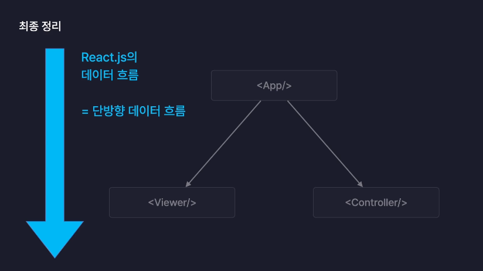

### react 시작

- npm create vite@latest

- npm i

- npm run dev

- 확장프로그램
- ESLint 설치
- .eslintrc.cjs
- "no-unused-vars": "off",
  "react/prop-types" : "off",

- useRef
- Reference 객체를 생성
- 컴포넌트 내부의 변수로 활용 가능
- 어떤 경우에도 리렌더링을 유발하지 않음

- useState
- State를 생성
- 컴포넌트 내부의 변수로 활용 가능
- 값이 변경되면 컴포넌트 리렌더링

- ReactHooks
- 클래스 컴포넌트의 기능을 함수 컴포넌트에서도 이용할 수 있도록 도와주는 메서드들

- React.js의 데이터 흐름
- 단방향 데이터 흐름
- 
