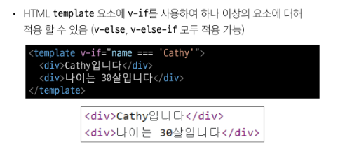
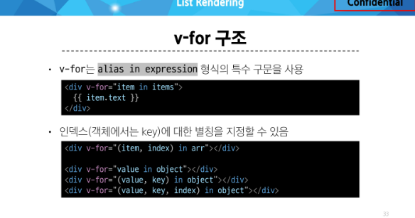

### Vue Basic Syntax 2

- computed()
- 계산된 속성을 정의하는 함수
  - 미리 계산된 속성을 사용하여 템플릿에서 표현식을 단순하게 하고 불필요한 반복 연산을 줄임

- 반환되는 값은 ref이며 계산된 결과는 value로 참조 가능
- (템플릿에서는 .value를 생략 가능)

### computed로 할수있는거는 method로도 할수 있지만 차이가 있다.
- computed 속성은 의존된 반응형 데이터를 기반으로 캐시된다.
- 의존하는 데이터가 변경된 경우에만 재평가됨
- 즉, 의존된 반응형 데이터가 변경되지 않는 한  이미 계산된 결과에 대한 여러 참조는 다시 평가할 필요 없이 이전에 계산된 결과를 즉시 반환

- 반면, method 호출은 다시 렌더링이 발생할 때마다 항상 함수를 실행

## computed와 method의 적절한 사용처
- computed
  - 의존하는 데이터에 따라 결과가 바뀌는 계산된 속성을 만들 때 유용
  - 동일한 의존성을 가진 여러 곳에서 사용할 때 계산 결과를 캐싱하여 중복 계산 방지

- method
  - 단순히 특정 동작을 수행하는 함수를 정의할 때 사용
  - 데이터에 의존하는지 여부와 관계없이 항상 동일한 결과를 반환하는 함수

---

# v-if
- 표현식 값의 true/false를 기반으로 요소를 조건부로 렌더링
- 하나의 요소에만 작성이 가능하다
- template 태그로 인해 if문 작성가능
- 
### v-show
- 표현식 값의 true/false를 기반으로 요소의 가시성을 전환
- on/off 개념이다

### v-if vs v-show
- v-if 
  - 초기 조건이 false인 경우 아무 작업도 수행하지 않음
  - 토글 비용이 높음
- v-show
  - 초기 조건에 관계없이 항상 렌더링
  - 초기 렌더링 비용이 더 높음

# List lendering

## v-for

- 

### 반드시 v-for와 key를 함께 사용한다.
- 내부 컴포넌트의 상태를 일관 되게 하여 데이터의 예측 가능한 행동을 유지하기 위함

### key는 반드시 각 요소에 대한 **고유한 값을 나타낼 수 있는 식별자**여야 함.

# watch()
- 하나 이상의 반응형 데이터를 감시하고, 감시하는 데이터가 변경되면 콜백함수를 호출

- Computed와 Watchers
- 