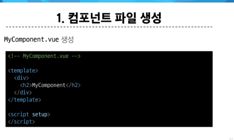
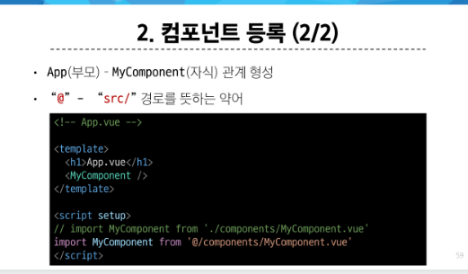

# Single-File Components

### Component
- 재사용 가능한 코드 블록

#### 특징
- UI를 독립적이고 재사용 가능한 일부분으로 분할하고 각 부분을 개별적으로 다룰 수 있음
  - 자연스럽게 애플리케이션은 중첩된 Component의 트리 형태로 구성됨

#### Single-File Components
- 컴포넌트의 템플릿, 로직 및 스타일을 하나의 파일로 묶어낸 특수한 파일 형식(*.vue 파일)


#### SFC 문법
```vue

<template>
  <div class="greeting">{{ msg }}</div>
</template>

<script setup>
import { ref } from 'vue'

const msg = ref('Hello World !')
</script>

<style scoped>
.greeting {
  color : red;
}
</style>

```

- 언어 블록의 순서는 상관없지만 template, script, style 순으로 작성하는것 일반적이다.


- 프로젝트 생성
- npm create vue@latest
- cd vue-project
- npm install
- npm run dev

### node-modeles 
- 외부 패키지들이 저장되는 디렉토리
- 프로젝트의 의존성 모듈을 저장하고 관리하는 공간
- 프로젝트가 실행될 때 필요한 라이브러리와 패키지들을 포함
- .gitignore에 작성됨


### package-lock.json
- 패키지들의 실제 설치 버전, 의존성 관계, 하위 패키지 등을 포함하여 패키지 설치에 필요한 모든 정보를 포함
- 패키지들의 정확한 버전을 보장하여, 여러 개발자가 협업하거나 서버 환경에서 일관성 있는 의존성을 유지하는 데 도움을 줌

### package.json
- 프로젝트의 메타 정보와 의존성 패키지 목록을 포함
- 프로젝트의 이름, 버전, 작성자, 라이선스 등과 같은 메타 정보를 정의

### public
- 주로 다음 정적 파일을 위치 시킴
  - 소스코드에서 참조되지 않는
  - 항상 같은 이름을 갖는
  - import 할 필요 없는
- 항상 root 절대 경로를 사용하여 참조
  - public/icon.png는 소스코드에서 / icon.png로 참조 할 수 있음

### src
- 프로젝트의 주요 소스 코드를 포함하는 곳
- 컴포넌트, 스타일, 라우팅 등 프로젝트의 핵심 코드를 관리

### src/assets
- 프로젝트 내에서 사용되는 자원(이미지, 폰트, 스타일 시트 등)을 관리
- 컴포넌트 자체에서 참조하는 내부 파일을 저장하는데 사용
- 컴포넌트가 아닌 곳에서는 public 디렉토리에 위치한 파일을 사용

### src/components
- Vue 컴포넌트들을 작성하는 곳

### src/App.vue
- Vue 앱의 최상위 Root 컴포넌트
- 다른 하위 컴포넌트들을포함
- 애플리케이션 전체의 레이아웃과 공통적인 요소를 정의

### src/main.js
- Vue 인스턴스를 생성하고, 애플리케이션을 초기화하는 역할
- 필요한 라이브러리를 import 하고 전역 설정을 수행

### index.html
- Vue 앱의 기본 html 파일
- 앱의 진입점
- Root 컴포넌트인 App.vue가 해당 페이지에 마운트 됨
- 필요한 스타일 시트, 스크립트 등의 외부 리소스를 로드 할 수 있음.

---

### 컴포넌트 사용 2단계
1. 컴포넌트 파일 생성
   - vbase-3-setup으로 기초 문법 작성
   - 
2. 컴포넌트 등록
   - 
   - 

### 컴포넌트 쓰는 법
```vue

  <MyComponent />
  <!-- 여는 태그 닫는 태그를 합쳐버린다. -->

```