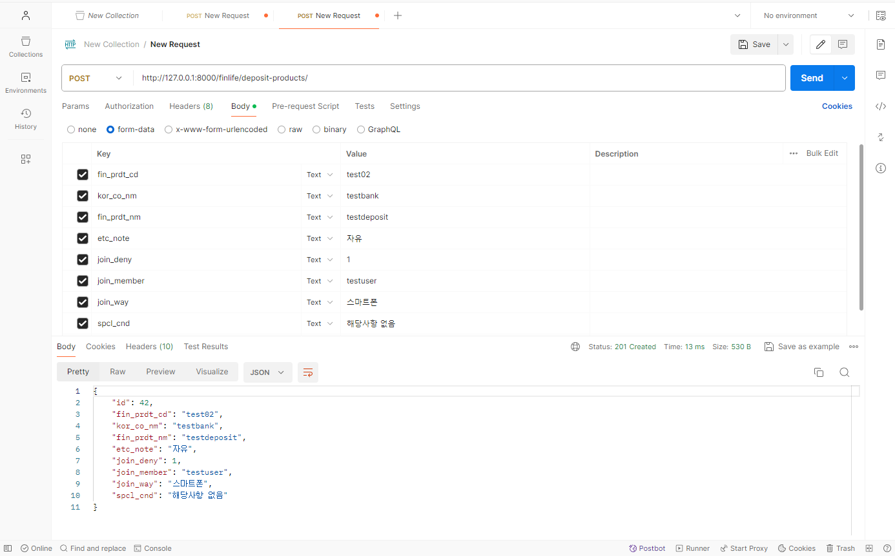

# 금융 상품 데이터를 활용한 REST API Server
> 이 프로젝트는 금융 상품 데이터를 활용하여 RESTful API 서버를 구축하는 것을 목표로 합니다.
> 
> 다음과 같은 기능을 구현합니다.

## 기능 목록
   - api_key를 비공개로 받아오기 위해 settings.py 및 views.py에 environ설정
      ```py
      # settings.py
      env = environ.Env(DEBUG=(bool, True))
      environ.Env.read_env(
          env_file=os.path.join(BASE_DIR, '.env')
      )

      API_KEY = env('API_KEY')
      API_URL = env('API_URL')
      ```
      ```py
      # views.py
      api_key = settings.API_KEY
      api_url = settings.API_URL
      ```
1. 정기예금 상품 목록 및 옵션 목록 저장
   - 정기예금 API로부터 상품 목록 정보와 옵션 목록 정보를 받아와서 DB에 저장
     ```py
      @api_view(['GET'])
      def save_deposit_products(request):
          params = {
            'auth': api_key,
            'topFinGrpNo': '020000',
            'pageNo': 1
          }
          response = requests.get(api_url, params=params).json().get('result')
            
          for base_item in response.get('baseList'):
              fin_prdt_cd = base_item.get('fin_prdt_cd')

              for key, value in base_item.items():
                  if not value:
                      if key == 'join_deny':
                          base_item[key] = -1
                      else:
                          base_item[key] = ''

              deposit_product, created = DepositProducts.objects.update_or_create(
                  fin_prdt_cd=fin_prdt_cd,
                  defaults={
                      'key': value
                  }
              )

              options = [opt for opt in response.get('optionList') if opt['fin_prdt_cd'] == fin_prdt_cd]

              for option in options:
                  for key, value in option.items():
                      if not value:
                          if key in ('fin_prdt_cd', 'intr_rate_type_nm'):
                              option[key] == ''
                          else:
                              option[key] = -1

                  DepositOptions.objects.create(
                      key=value
                  )

          return JsonResponse({'message':'okay'})
      ```
   - ``params ={}`` 에 필요한 데이터를 입력하여 API를 받아온 후, ``.json()``을 활용하여 json형태로 반환
   - 필요한 자료를 추출하기 전, API의 구조를 먼저 확인
      
      ``{result: {baseList:[], optionList:[],}}``
   - 모든 자료를 순회하면서 값이 없다면 적당한 값으로 대체한 후 저장

2. 전체 정기예금 상품 목록 출력
   - DB에 저장된 모든 정기예금 상품 목록을 반환
     ```py
      @api_view(['GET', 'POST'])
      def deposit_products(request):
      if request.method == 'POST':
          pass
      else:
          deposit_products = DepositProducts.objects.all()
          serializer = DepositProductsSerializer(deposit_products, many=True)
          return Response(serializer.data)
      ```
   - GET 요청이 들어왔을 때 실행
   - 모든 정기예금 상품 리스트를 반환 => 하나 이상의 데이터가 반환 될 수 있으므로,
     ``many=True``사용.

3. 정기예금 상품 추가하기
   - 요청과 함께 전송된 데이터를 DB에 저장
     ```py
      @api_view(['GET', 'POST'])
      def deposit_products(request):
      if request.method == 'POST':
          serializer = DepositProductsSerializer(data=request.data)
          if serializer.is_valid():
              serializer.save()
              return Response(serializer.data, status=status.HTTP_201_CREATED)
          return Response(serializer.errors, status=status.HTTP_400_BAD_REQUEST)
      else:
          ...
     ```
   - POST 요청이 들어왔을 때 새로운 데이터 추가
   - 새로운 데이터 추가를 위해 POSTMAN 사용
   - 
4. 특정 상품의 옵션 리스트 출력
   - 상품 코드에 따라 해당 상품의 옵션 리스트를 출력
    ```py
    @api_view(['GET'])
    def deposit_product_options(request, fin_prdt_cd):
    try:
        options = DepositOptions.objects.filter(fin_prdt_cd=fin_prdt_cd)
        serializer = DepositOptionsSerializer(options, many=True)
        return Response(serializer.data)
    except DepositOptions.DoesNotExist:
        return Response(status=status.HTTP_404_NOT_FOUND)
    ```
    - fin_prdt_cd를 인자로 받아 상품명이 일치하는 상품의 옵션 리스트 반환

5. 금리가 가장 높은 상품의 정보 출력
   - 최고 우대 금리가 가장 높은 상품의 상세 정보와 옵션을 반환
    ```py
      @api_view(['GET'])
      def top_rate(request):
      try:
          top_option = DepositOptions.objects.latest('intr_rate2')

          top_product = DepositProducts.objects.get(fin_prdt_cd=top_option.fin_prdt_cd)

          product_serializer = DepositProductsSerializer(top_product)
          option_serializer = DepositOptionsSerializer(top_option)

          response_data = {
              'product': product_serializer.data,
              'option': option_serializer.data
          }
          return Response(response_data)
      except DepositOptions.DoesNotExist:
          return Response({'message': 'No deposit products found'}, status=status.HTTP_404_NOT_FOUND)
    ```
  - ``.latest`` 메서드를 활용하여, 최고 우대 금리가 가장 높은 값의 상품을 추출
  

## API Endpoints
#### A. 정기예금 상품 목록 및 옵션 목록 저장
- URL: GET /finlife/save-deposit-products/
#### B. 전체 정기예금 상품 목록 출력
- URL: GET /finlife/deposit-products/
#### C. 정기예금 상품 추가하기
- URL: POST /finlife/- deposit-products/
#### D. 특정 상품의 옵션 리스트 출력
- URL: GET /finlife/deposit-product-options/<str:fin_prdt_cd>/
#### E. 금리가 가장 높은 상품의 정보 출력
- URL: GET /finlife/deposit-products/top-rate/

## 기술 스택
- Python
- Django
- Django REST Framework

## 어려웠던 부분
 - API 자료를 해석하고, 저장하는 과정에서 데이터의 전처리가 어려웠습니다.
 - 필요한 자료에서 옵션 목록 정보는 상품 모델의 기본 키를 외래 키로 참조하고 있었는데, 상품 모델을 받아오면서 옵션 목록 정보를 한번에 처리하기 위한 함수를 작성하다 보니 놓치는 부분이 많이 발생하였습니다.
 - 평소 진행하던 장고 프로젝트와 달리 html파일을 통해 결과를 받는 것이 아닌, Response 및 JsonResponse를 통해 json 형태의 데이터만 확인할 수 있었는데, 익숙하지 않아 헷갈리는 부분이 많았습니다.
## 해결 방안
 - 자료를 저장하는 과정에서, 어느 부분까지 자료를 받아왔는지 가시적으로 확인하기 위해 response 데이터에 여러 key를 추출하면서 print해보거나 postman으로 확인하면서 진행하는 과정을 꾸준히 거쳐주었습니다.
 - 데이터의 확인 및 추가를 하는 과정에서 postman을 적극 활용하여 보다 쉽게 API 데이터를 다룰 수 있게 되었습니다.