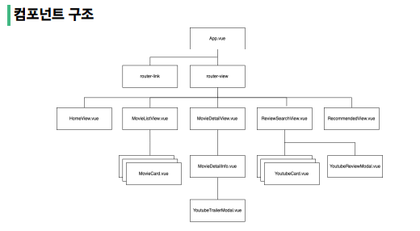
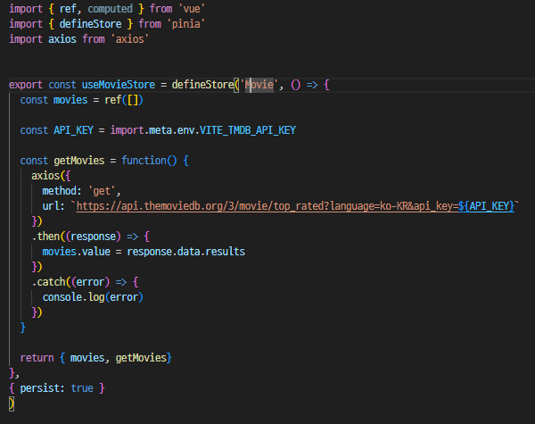

# 5/10 . PJT 09 - 영화 (Vue를 활용한 SPA 구성)

## 프로젝트 개요

- Vue를 활용하는 SPA 구성
- TMDB API에서 제공하는 영화 데이터를 활용한 영화 정보 제공 애플리케이션 완성
- Youtube API에서 제공하는 검색 기능을 활용 가능한 애플리케이션 완성

## 프로젝트 목표

- 영화 정보를 제공하는 SPA 제작
- AJAX와 JSON에 대한 이해
- 외부 API와의 요청과 응답을 통한 데이터 수집
- Vite Frontent Tooling에 대한 이해

## 개발 도구

- VScode
- Chrome
- Vue 3

## 사용 API

- TMDB API v3
  - https://developer.themoviedb.org/reference/movie-details (개별 영화 세부정보)
  - https://developer.themoviedb.org/reference/movie-top-rated-list (평점별로 정렬된 영화 목록)

- Youtube API
  - https://www.googleapis.com/youtube/v3/search

## 컴포넌트 구조

### A. 최고 평점 영화 조회

- 내비게이션 바에서 영화 조회 링크(/movies)를 클릭하면 평점이 높은 순으로 정렬된 영화 목록을 출력 (TMDB API - MOVIES LISTS - Top Rated 활용)

- API_KEY를 가져오는 코드를 알지 못해서 교안/ 구글링을 통해서 API_KEY를 받아오는법을 알게되었음.
- movies.value = respose.data.results
- 데이터가 results라는 배열로 감싸져있었는데 처음에 results를 적지 않아서 데이터가 추출이 되지 않아 한참을 헤맸음.

### B. 최고 평점 영화의 세부정보 조회

- MovieCard를 클릭하면 RouterLink를 통해 MovieDetailView(/:movieId)로 이동 후 MovieDetailInfo를 출력 (TMDB API - MOVIES - Details 활용)

- 세부정보에서 유튜브 버튼을 클릭하면 영화 제목 데이터를 활용해 해당 영화의 공식 예고편을 YoutubeTrailerModal에서 출력 (Youtube API 활용)
- 처음에는 store 안에 axios를 작성하여 mount하여 들고왔는데, 데이터가 추출이 되지 않아서, Detail 파일안에서 axios를 작성하여 문제를 해결하였음.

### 어려웠던 점

- API를 가져오는 것이 어려웠다.

- Pinia에 대한 이해가 많이 부족하다는 것을 느꼈다.

- Axios에 대한 이해가 아직 완벽하지 않다는 것을 느꼈다.